<div align="center">

# ✨ Anime Reaction Vault

> **Your local-first, mood-sorted library of 1123 anime reaction GIFs**

> No CDN. No hotlink rot. Just clone and use — every GIF lives right here as a file.

[](./)
[](./)
[](./)
[](./)

</div>

<p align="center">
  
  
  
  
  
  
</p>

<p align="center">
  <i>hug · dance · cry · smug · wink · pat — six moods, one vault</i>
</p>

---

## 🧭 What makes this different?

This isn't just another flat A-Z list. It's an **Emotion Atlas**:

- **5 Mood Zones** instead of 70 scattered entries — find the *feeling*, not just the keyword
- **Local-first previews** — every `` points to a file in this repo, not an external raw URL that can disappear
- **Copy-paste ready** — local path pattern for every category, with width-controlled preview
- **Presentation-ready** — use it for your site, Discord bot, README, slides, or Notion — all offline-friendly

---

## 📊 Stats

| Stat | Value |
|------|-------|
| **Total categories** | **70** |
| **Total GIFs** | **1123** |
| **Avg per category** | **16** |
| **Largest category** | `nom` / `cry` — 46 GIFs each |
| **Smallest categories** | `shrug` / `slowclap` — 3 GIFs |
| **Storage** | 100% local files — no external dependency |

---

## 🗺️ How to navigate

| Zone | Vibe | When to use it |
|------|------|----------------|
| 💖 **LOVE & AFFECTION** | soft, sweet, close | cuddle, kiss, pat, comfort |
| 🎉 **JOY & HYPE** | loud, bright, celebratory | claps, dance, cheers, yay! |
| 😌 **SOFT & BLUE** | gentle, tired, tender | cry, sleep, shy, nervous |
| 😡 **FIRE & FIGHT** | sharp, angry, dramatic | mad, slap, facepalm, pout |
| 🤪 **SILLY & SURPRISE** | weird, goofy, curious | bleh, huh, wink, woah |

> **Tip for presentation:** open a Zone → click a preview → copy the Local Path. No GitHub raw link needed.

---

## 💖🎉😌😡🤪 Mood Atlas — Browse by Feeling

Click a zone to expand. Every preview below is rendered **directly from the file** (e.g. `./hug/1.gif`) — if you clone the repo, it still works.


<details>
<summary><b>💖 LOVE & AFFECTION — soft, sweet, close</b> — 10 categories · 224 GIFs — <i>For whispers, comfort and all the warm fuzzy feelings.</i></summary>

| Category | GIFs | Local Path | Preview |
|----------|------|------------|---------|
| `airkiss` | 6 | `./airkiss/{1..6}.gif` |  |
| `blush` | 41 | `./blush/{1..41}.gif` |  |
| `cuddle` | 30 | `./cuddle/{1..30}.gif` |  |
| `handhold` | 10 | `./handhold/{1..10}.gif` | 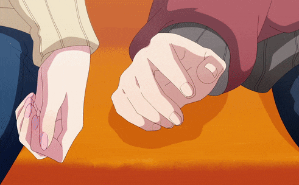 |
| `hug` | 40 | `./hug/{1..40}.gif` |  |
| `kiss` | 36 | `./kiss/{1..36}.gif` |  |
| `lick` | 14 | `./lick/{1..14}.gif` |  |
| `love` | 9 | `./love/{1..9}.gif` |  |
| `nuzzle` | 10 | `./nuzzle/{1..10}.gif` |  |
| `pat` | 28 | `./pat/{1..28}.gif` |  |

</details>

<details>
<summary><b>🎉 JOY & HYPE — loud, bright, celebratory</b> — 16 categories · 210 GIFs — <i>For wins, laughs and good vibes only.</i></summary>

| Category | GIFs | Local Path | Preview |
|----------|------|------------|---------|
| `brofist` | 9 | `./brofist/{1..9}.gif` |  |
| `celebrate` | 7 | `./celebrate/{1..7}.gif` | 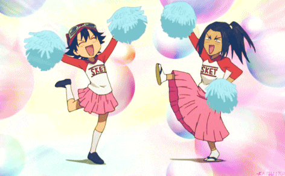 |
| `cheers` | 6 | `./cheers/{1..6}.gif` |  |
| `clap` | 8 | `./clap/{1..8}.gif` |  |
| `cool` | 4 | `./cool/{1..4}.gif` |  |
| `dance` | 33 | `./dance/{1..33}.gif` |  |
| `happy` | 15 | `./happy/{1..15}.gif` |  |
| `laugh` | 17 | `./laugh/{1..17}.gif` |  |
| `sing` | 19 | `./sing/{1..19}.gif` | 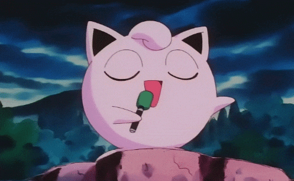 |
| `slowclap` | 3 | `./slowclap/{1..3}.gif` |  |
| `smile` | 20 | `./smile/{1..20}.gif` |  |
| `smug` | 21 | `./smug/{1..21}.gif` |  |
| `thumbsup` | 6 | `./thumbsup/{1..6}.gif` |  |
| `wave` | 23 | `./wave/{1..23}.gif` |  |
| `yay` | 10 | `./yay/{1..10}.gif` |  |
| `yes` | 9 | `./yes/{1..9}.gif` |  |

</details>

<details>
<summary><b>😌 SOFT & BLUE — gentle, tired, tender</b> — 15 categories · 255 GIFs — <i>For low-energy, shy or teary moments. Rainy-day feels.</i></summary>

| Category | GIFs | Local Path | Preview |
|----------|------|------------|---------|
| `cry` | 46 | `./cry/{1..46}.gif` |  |
| `drool` | 12 | `./drool/{1..12}.gif` |  |
| `nervous` | 18 | `./nervous/{1..18}.gif` |  |
| `sad` | 5 | `./sad/{1..5}.gif` | 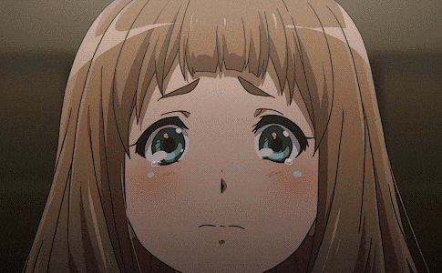 |
| `scared` | 43 | `./scared/{1..43}.gif` |  |
| `shy` | 18 | `./shy/{1..18}.gif` |  |
| `sigh` | 8 | `./sigh/{1..8}.gif` |  |
| `sip` | 12 | `./sip/{1..12}.gif` |  |
| `sleep` | 35 | `./sleep/{1..35}.gif` | 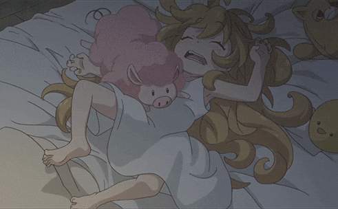 |
| `sneeze` | 4 | `./sneeze/{1..4}.gif` | 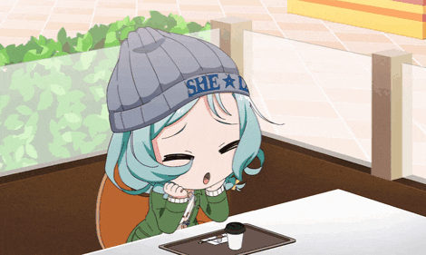 |
| `sorry` | 4 | `./sorry/{1..4}.gif` |  |
| `stare` | 21 | `./stare/{1..21}.gif` |  |
| `sweat` | 4 | `./sweat/{1..4}.gif` |  |
| `tired` | 15 | `./tired/{1..15}.gif` | 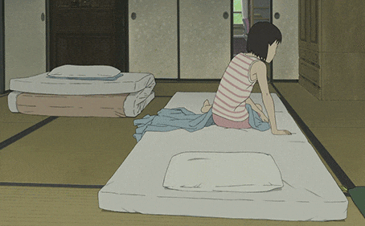 |
| `yawn` | 10 | `./yawn/{1..10}.gif` |  |

</details>

<details>
<summary><b>😡 FIRE & FIGHT — sharp, angry, dramatic</b> — 13 categories · 214 GIFs — <i>For rage, smacks and *that* facepalm energy.</i></summary>

| Category | GIFs | Local Path | Preview |
|----------|------|------------|---------|
| `angrystare` | 32 | `./angrystare/{1..32}.gif` |  |
| `bite` | 20 | `./bite/{1..20}.gif` |  |
| `evillaugh` | 10 | `./evillaugh/{1..10}.gif` |  |
| `facepalm` | 5 | `./facepalm/{1..5}.gif` |  |
| `headbang` | 8 | `./headbang/{1..8}.gif` | 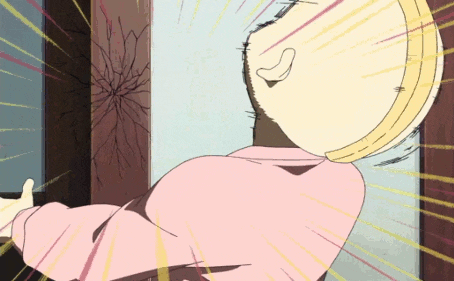 |
| `mad` | 26 | `./mad/{1..26}.gif` |  |
| `no` | 8 | `./no/{1..8}.gif` |  |
| `pout` | 29 | `./pout/{1..29}.gif` | 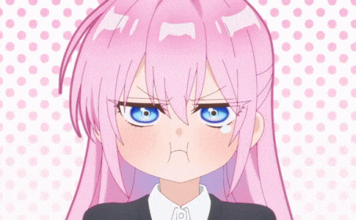 |
| `punch` | 15 | `./punch/{1..15}.gif` |  |
| `shout` | 9 | `./shout/{1..9}.gif` |  |
| `slap` | 25 | `./slap/{1..25}.gif` | 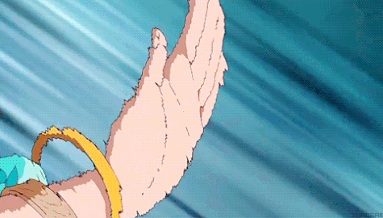 |
| `smack` | 18 | `./smack/{1..18}.gif` | 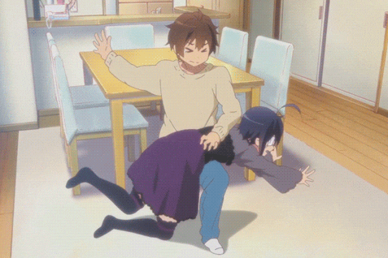 |
| `stop` | 9 | `./stop/{1..9}.gif` | 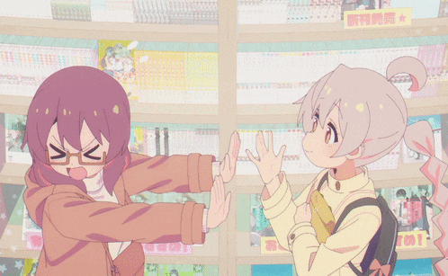 |

</details>

<details>
<summary><b>🤪 SILLY & SURPRISE — weird, goofy, curious</b> — 16 categories · 220 GIFs — <i>For huh?!, nom nom and total chaos.</i></summary>

| Category | GIFs | Local Path | Preview |
|----------|------|------------|---------|
| `bleh` | 7 | `./bleh/{1..7}.gif` |  |
| `confused` | 8 | `./confused/{1..8}.gif` |  |
| `huh` | 6 | `./huh/{1..6}.gif` |  |
| `nom` | 46 | `./nom/{1..46}.gif` |  |
| `nosebleed` | 5 | `./nosebleed/{1..5}.gif` | 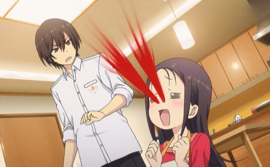 |
| `nyah` | 8 | `./nyah/{1..8}.gif` |  |
| `peek` | 6 | `./peek/{1..6}.gif` |  |
| `pinch` | 11 | `./pinch/{1..11}.gif` |  |
| `poke` | 18 | `./poke/{1..18}.gif` | 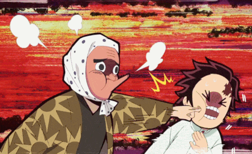 |
| `roll` | 7 | `./roll/{1..7}.gif` |  |
| `run` | 26 | `./run/{1..26}.gif` | 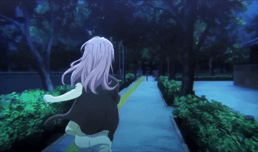 |
| `shrug` | 3 | `./shrug/{1..3}.gif` |  |
| `surprised` | 19 | `./surprised/{1..19}.gif` |  |
| `tickle` | 9 | `./tickle/{1..9}.gif` |  |
| `wink` | 33 | `./wink/{1..33}.gif` |  |
| `woah` | 8 | `./woah/{1..8}.gif` | 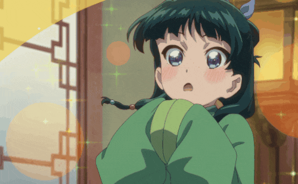 |

</details>


---

## 📚 Complete Index — A → Z

> All 70 categories alphabetically. Local path pattern shows exactly how to reference any frame: `./category/N.gif`

| Category | GIFs | Local Path | Preview |
|----------|------|------------|---------|
| `airkiss` | 6 | `./airkiss/{1..6}.gif` |  |
| `angrystare` | 32 | `./angrystare/{1..32}.gif` |  |
| `bite` | 20 | `./bite/{1..20}.gif` |  |
| `bleh` | 7 | `./bleh/{1..7}.gif` |  |
| `blush` | 41 | `./blush/{1..41}.gif` |  |
| `brofist` | 9 | `./brofist/{1..9}.gif` |  |
| `celebrate` | 7 | `./celebrate/{1..7}.gif` |  |
| `cheers` | 6 | `./cheers/{1..6}.gif` |  |
| `clap` | 8 | `./clap/{1..8}.gif` |  |
| `confused` | 8 | `./confused/{1..8}.gif` |  |
| `cool` | 4 | `./cool/{1..4}.gif` |  |
| `cry` | 46 | `./cry/{1..46}.gif` |  |
| `cuddle` | 30 | `./cuddle/{1..30}.gif` |  |
| `dance` | 33 | `./dance/{1..33}.gif` |  |
| `drool` | 12 | `./drool/{1..12}.gif` |  |
| `evillaugh` | 10 | `./evillaugh/{1..10}.gif` |  |
| `facepalm` | 5 | `./facepalm/{1..5}.gif` |  |
| `handhold` | 10 | `./handhold/{1..10}.gif` |  |
| `happy` | 15 | `./happy/{1..15}.gif` |  |
| `headbang` | 8 | `./headbang/{1..8}.gif` |  |
| `hug` | 40 | `./hug/{1..40}.gif` |  |
| `huh` | 6 | `./huh/{1..6}.gif` |  |
| `kiss` | 36 | `./kiss/{1..36}.gif` |  |
| `laugh` | 17 | `./laugh/{1..17}.gif` |  |
| `lick` | 14 | `./lick/{1..14}.gif` |  |
| `love` | 9 | `./love/{1..9}.gif` |  |
| `mad` | 26 | `./mad/{1..26}.gif` |  |
| `nervous` | 18 | `./nervous/{1..18}.gif` |  |
| `no` | 8 | `./no/{1..8}.gif` |  |
| `nom` | 46 | `./nom/{1..46}.gif` |  |
| `nosebleed` | 5 | `./nosebleed/{1..5}.gif` |  |
| `nuzzle` | 10 | `./nuzzle/{1..10}.gif` |  |
| `nyah` | 8 | `./nyah/{1..8}.gif` |  |
| `pat` | 28 | `./pat/{1..28}.gif` |  |
| `peek` | 6 | `./peek/{1..6}.gif` |  |
| `pinch` | 11 | `./pinch/{1..11}.gif` |  |
| `poke` | 18 | `./poke/{1..18}.gif` |  |
| `pout` | 29 | `./pout/{1..29}.gif` |  |
| `punch` | 15 | `./punch/{1..15}.gif` |  |
| `roll` | 7 | `./roll/{1..7}.gif` |  |
| `run` | 26 | `./run/{1..26}.gif` |  |
| `sad` | 5 | `./sad/{1..5}.gif` |  |
| `scared` | 43 | `./scared/{1..43}.gif` |  |
| `shout` | 9 | `./shout/{1..9}.gif` |  |
| `shrug` | 3 | `./shrug/{1..3}.gif` |  |
| `shy` | 18 | `./shy/{1..18}.gif` |  |
| `sigh` | 8 | `./sigh/{1..8}.gif` |  |
| `sing` | 19 | `./sing/{1..19}.gif` |  |
| `sip` | 12 | `./sip/{1..12}.gif` |  |
| `slap` | 25 | `./slap/{1..25}.gif` |  |
| `sleep` | 35 | `./sleep/{1..35}.gif` |  |
| `slowclap` | 3 | `./slowclap/{1..3}.gif` |  |
| `smack` | 18 | `./smack/{1..18}.gif` |  |
| `smile` | 20 | `./smile/{1..20}.gif` |  |
| `smug` | 21 | `./smug/{1..21}.gif` |  |
| `sneeze` | 4 | `./sneeze/{1..4}.gif` |  |
| `sorry` | 4 | `./sorry/{1..4}.gif` |  |
| `stare` | 21 | `./stare/{1..21}.gif` |  |
| `stop` | 9 | `./stop/{1..9}.gif` |  |
| `surprised` | 19 | `./surprised/{1..19}.gif` |  |
| `sweat` | 4 | `./sweat/{1..4}.gif` |  |
| `thumbsup` | 6 | `./thumbsup/{1..6}.gif` |  |
| `tickle` | 9 | `./tickle/{1..9}.gif` |  |
| `tired` | 15 | `./tired/{1..15}.gif` |  |
| `wave` | 23 | `./wave/{1..23}.gif` |  |
| `wink` | 33 | `./wink/{1..33}.gif` |  |
| `woah` | 8 | `./woah/{1..8}.gif` |  |
| `yawn` | 10 | `./yawn/{1..10}.gif` |  |
| `yay` | 10 | `./yay/{1..10}.gif` |  |
| `yes` | 9 | `./yes/{1..9}.gif` |  |

---

## 💻 How to Use (local-first)

All GIFs are plain files. No API key, no CDN. Just reference the path.

### 1. Markdown (README / Notion / GitHub)

```md


```

### 2. HTML (slides, website)

```html


```

### 3. JavaScript — random GIF picker

```js
// pick a random hug
const n = Math.floor(Math.random() * 40) + 1;
const url = `./hug/${n}.gif`; // -> ./hug/7.gif
document.querySelector('img').src = url;
```

### 4. Python — Discord bot / automation

```python
import random, pathlib
cat = "pat"
count = len(list(pathlib.Path(cat).glob("*.gif")))
gif = f"./{cat}/{random.randint(1,count)}.gif"
# send gif
```

### 5. Copy pattern

Every category follows:

```
./<category>/{1..N}.gif   →   ./hug/1.gif  ·  ./hug/2.gif  · ... · ./hug/40.gif
```

Just replace `N` with the count from the table above.

---

## 🗂️ Folder Structure

```
./
├── airkiss/   → 1.gif … 6.gif
├── hug/       → 1.gif … 40.gif
├── cry/       → 1.gif … 46.gif
├── wink/      → 1.gif … 33.gif
├── ... 70 folders
└── README.md  → you are here
```

> Each folder is numbered sequentially from `1.gif`. No gaps, no nested folders.

---

## ➕ Adding More GIFs

1. Drop `N+1.gif` into the right folder (e.g. `hug/41.gif`)
2. GIF will instantly show up via the `./hug/41.gif` path — no config needed
3. Optional: update the Stats table above (or run the counter script)

Create a new mood? Just add a folder:

```bash
mkdir nyan
# add 1.gif, 2.gif ...
```

It will be picked up automatically by the file-based pattern.

---

## 🎤 Presentation Tips

- **Live demo:** open 3 previews side-by-side to show mood contrast: `./cry/1.gif` vs `./dance/1.gif` vs `./angrystare/1.gif`
- **Slides:** embed local files — works offline, no broken hotlinks on stage
- **Mood game:** ask audience *\"which zone is this?\"* and let them guess 💖/😡/🤪

---

## 📜 License & Credits

- GIFs are from various anime sources — for personal / fair-use / reaction purposes.
- Vault curation & mood-sorting by the local-first philosophy — no external CDN required.

<div align="center">

**If you like the vault, star it and share a mood!**

`./yay/1.gif` · `./love/1.gif` · `./cheers/1.gif`

<p>
  
  
  
</p>

*Built to be cloned, browsed, and presented — anywhere.*

</div>
